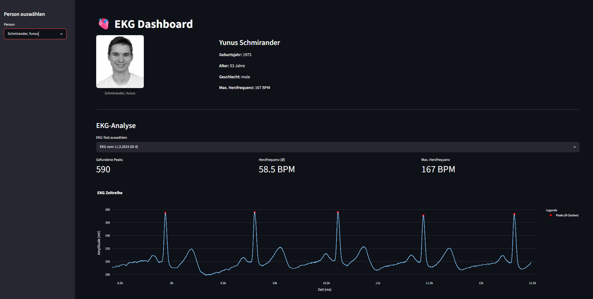

# EKG Dashboard


Eine Streamlit-App zur Visualisierung und Analyse von EKG-Daten. Personen können aus einer Datenbank geladen werden. Pro Person werden EKG-Zeitreihen dargestellt, R-Zacken (Peaks) automatisch erkannt und die durchschnittliche Herzfrequenz berechnet.



## Projektstruktur

-`src` enthält `person.py` und `ekgdata.py`
-`person.py` enthält die Klasse `Person` mit Mehoden zum Laden der Personen, Berechnung des Alters, Maximalpuls und laden des Profilbilds
-`ekgdata.py` enthält die Klasse `EKGdata` zum Laden, Analysieren und Visualisieren von EKG-Messdaten 
-`data` enthält all die Daten die gespeist werden
-`main.py` Streamlit Oberfläche für das EKG-Dashboard, das eine Person auswöhlt, ihre Basisdaten anzeigt und EKG-Analyse/Visualisierung darstellt

## Features

- Personenauswahl mit Profilbild, Alter und maximaler Herzfrequenz
- Interaktiver EKG-Plot mit markierten Peaks
- Automatische Herzfrequenzberechnung aus den R-R-Intervallen


## Starten der App

Das Projekt verwendet PDM als Paketmanager!

```bash
# Abhängigkeiten installieren
pdm install

# App starten
pdm run streamlit run main.py
```

## Abhängigkeiten

- `streamlit`
- `pandas`
- `plotly`
- `scipy`
- `numpy`
- `Pillow`
